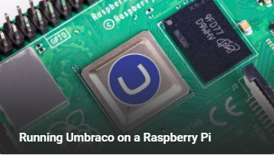

# Links for Edinbuug : 27th Jan 2021

Some helpful steps and links : 

Full details in the Skrift.io Article : 
[Running Umbraco on a Raspberry Pi or How I stopped worrying and learned to love Linux](https://skrift.io/issues/running-umbraco-on-a-raspberry-pi-or-how-i-stopped-worrying-and-learned-to-love-linux/)

## Installing Nightly Build on a Pi

Youtube Walkthrough:

Warning : I lack video editing skills (for now) so this is a slightly longer-than-it-needs-to-be video.

TL:DR Steps : Make appropriate choices to try either the Alpha or nightly

1 - Set your Pi Up + connect to it (See Article for details if you're stuck)

2 - Run the .net Core install script

    wget -O - https://raw.githubusercontent.com/CarlSargunar/UmbracoPi/main/Install/installCore.sh | sudo bash

3 - Add the Nuget source (Nightly)

For Alpha : 

    dotnet nuget add source "https://www.myget.org/F/umbracoprereleases/api/v3/index.json" -n "Umbraco Prereleases"

For Nightly :    

    dotnet nuget add source "https://www.myget.org/F/umbraconightly/api/v3/index.json" -n "Umbraco Nightly"

4 - Add the Template

For Alpha : 

    dotnet new -i Umbraco.Templates::0.5.0-alpha002

For Nightly :    

    dotnet new -i Umbraco.Templates::0.5.0-*

5 - Create the Project

    dotnet new umbraco -n MyNewSite

6 - Build the Project

    cd MyNewSite
    dotnet build
    
7 - Run the Project

    dotnet run

8 - Profit?

You'll need a sql server somewhere running a database that you can use

Other useful links :

 - CMS Docs net Core Specific : https://github.com/umbraco/UmbracoCMSDocs
 - Using Nightly Builds : https://our.umbraco.com/documentation/UmbracoNetCoreUpdates#net-core-nightly-builds
 - Install .net Core on Debian : https://docs.microsoft.com/en-gb/dotnet/core/install/linux-scripted-manual#scripted-install
 - Links for .net Core : https://dotnet.microsoft.com/download/dotnet-core/3.1

