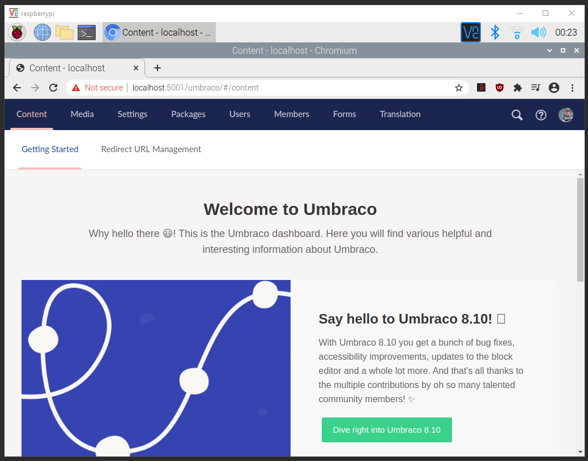
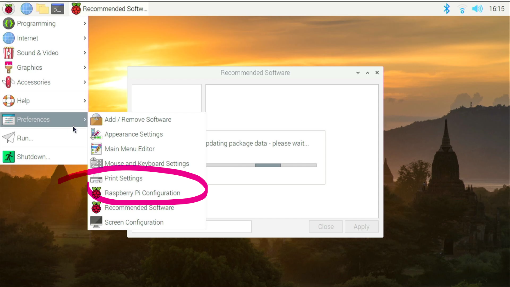
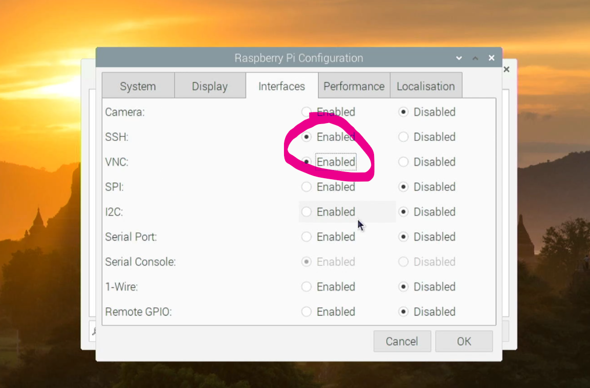

# Running Umbraco on a Raspberry Pi or How I stopped worrying and learned to love Linux

Why would you want to run Umbraco on a Raspberry Pi? Well, the short answer is, you wouldn't. It's not powerful enough to be useful in a production environment, it's "experimental"... well, still in Alpha. That's not the full story though, and the reason it's worthwhile doing is because of .NET Core, or as it will be known as going forward, .NET 5. 

We're about to go on a journey, you and I, which will install and setup .NET on a Pi and fire up the latest alpha of project UniCore. I'm assuming here that you a .NET Framework developer who wants to know a bit more about the cross platform capabilities of .NET Core, or .Net 5. However before we go too far forward, at this point we need a Wayne's World flashback on the history of .NET.

## A little history of .NET Core

There's a lot of content written about this but the TL:DR version is that after Microsoft released .NET back in 2000 and for a long time, everything was good - as long as you used Windows.

Then in 2004 a very smart chap called [Miguel de Icaza](https://twitter.com/migueldeicaza) started the [Mono Project](https://www.mono-project.com/) with the intention of running the framework on Linux. Lots of work followed, a fantastic tool called Xamarin was released - a cross platform tool for smartphone app development. 

Fast forward a bit, Microsoft took note and in 2014 [announced asp.NET vNext during the community stantup](https://www.youtube.com/watch?v=1rLbT6pBtak) and they open sourced it all, eventually bought Xamarin and Github and released a [roadmap for .NET](https://github.com/dotnet/core/blob/master/roadmap.md) to unify the framework and .NET core into a single release. 

Finally in November 2020, [.NET 5 was released](https://devblogs.microsoft.com/dotnet/announcing-net-5-0/) to great acclaim and universal celebration all around. 

## Well that's great and all but so what?

This is a big deal, and there are plenty of examples online of compiling a [self-contained console app](https://docs.microsoft.com/en-us/dotnet/core/deploying/#self-contained-application) on Windows, copying it onto a USB drive, popping it into a Mac and firing it up and boom! And this is where it becomes interesting to us as Umbraco developers, because that's the future - .NET Everywhere!!!

Windows server and IIS are never going to catch up to Linux in the application hosting world. Knowing this, but building the tools to allow .NET to run basically anywhere, Microsoft neatly sidestepped the problem and gained access to a much bigger market. Make no mistake, in the future, your websites will be hosted and running on Linux.

## Introducing the Raspberry Pi

The Raspberry Pi, first created in 2012 is a single board ARM-based computer that has been getting faster and more **functional**. You don't need anything like the most recent one, a Raspberry Pi 2 or  greater will do. You need at least a Pi 2 because of certain instructions which aren't available in the Pi zero or first generation, but if you want to buy one I'd recommend a Pi 4. The latest [Raspberry Pi 400](https://thepihut.com/products/raspberry-pi-400) is a £70 computer that's built into a keyboard and is quite simply astonishing!

If you've never used Linux, but want to try it's a fantastic way of getting up and running on a small cheap device, and it will open a gateway into a fantastic world of the Internet of Things. The instructions in this guide will also work on Linux, so if you don't have a Raspberry Pi, and want to try this, you could also do this on either an old computer or a virtual machine running Linux. 

There are a few things you're going to have to remember when going through these steps

 - This is all very experimental. Some times things don't work
 - If things don't work the things to try are
   - Did you install all updates
   - Did you restart the pi
   - Did you give up, wipe the disk and start from scratch 

Be patient, keep trying and if you get stuck reach out - there are a lot of very helpful people out there who will help, and if I can I would be more than happy to :-)

## Recommended setup

So - you've got your Raspberry Pi 2 or greater, what else will you need?

 - A windows computer capable of running SQL Server Express to act as a database server for the Raspberry Pi (more on that later)
 - A MicroSD card, I would suggest minimum of 4gb, preferably 8gb
 - *OPTIONALLY* - A fast USB drive. Micro SD cards are a lot slower than SSDs, and the RPi4 supports usb3 which makes things a lot faster when experimenting
 - Some way of viewing the output of the pi
   - A monitor which you can plug into the Raspberry Pi to get things setup. Once it's set-up you can run it purely on a network
   - A HDMI Capture device which can output the HDMI signal form the Pi to your host computer (Note: This is more advanced to set-up so if you want to go down this route and get stuck, please reach out and I'll be happy to help if I can) 
 - Your usual peripherals - Keyboard, Mouse, endless supply of tea or coffee

One thing to note - whilst this WILL work on a Raspberry Pi 2, it's a very slow computer and you will be waiting around a lot. I would really recommend a more recent Pi, because even the Pi 4 can take a little while to get things going.

You'll also need to :

 - Download [Raspberry Pi OS](https://www.raspberrypi.org/software/operating-systems/) - you'll need to choose the right version depending on which Pi you have, but the Lite version is what I normally use.
 - An SD imaging tool - I use [Balena Etcher](https://www.balena.io/etcher/) as it's one of the most flexible ones but alternatively the [Raspberry Pi Imager](https://www.raspberrypi.org/software/) works too

Once you've got that all ready and a fresh hot drink on stand-by, it's time to start

1. Using Balena Etcher, or the Raspberry Pi Imager mount your chosen operating system onto the card using your main computer. Once copied, insert the card into the Pi, connect the display and power it up.
    - You'll need to go through the start-up and set-up process and connect the Pi to the internet - this will be needed to complete later parts of this guide.
    - There's a more in-depth guide [here](https://www.raspberrypi.org/help/quick-start-guide.../)
2. *OPTIONALLY* - You can use the guide [here](https://www.raspberrypi.org/documentation/hardware/raspberrypi/bootmodes/msd.md) to boot your Pi from USB, which tends to be a fair amount faster and more reliable than the MicroSD card, especially if you can mount it on a USB3 port
3. Install all the updates required, there will almost certainly be a bunch of updates to install. To do that open a terminal window or connect to the Pi over SSH and type in the following commands. Each will take between a few seconds to a few minutes depending on how many updates there are.
    - sudo apt-get -y update
    - sudo apt-get -t upgrade
4. Restart the pi once the updates are all completed with the following command
    - sudo reboot
5. *OPTIONALLY* - You can run through this entire guide with a monitor and keybord plugged into the Pi, but it might be simpler for you to do it all remotely. If this sounds like it could help, follow the steps at the end of this guide

Once that's all done we're ready to do the next step of getting .NET up and running, but before doing that it's an idea to explore around the Raspberry operating system to get familiar with it.

## Getting .Net Core up and running

Once you're ready to set-up .NET on the Pi. Unfortunately there isn't an automated installation for .NET which runs on ARM - you need to do this manually - See [https://docs.microsoft.com/en-us/dotnet/core/install/Linux-debian](https://docs.microsoft.com/en-us/dotnet/core/install/Linux-debian). 

Fortunately, building on the work of the excellent [Pete Gallagher](https://twitter.com/pete_codes) there's now a script to get everything installed and set-up for .NET Core 3.1 on the Pi.

Run the following command in a terminal window. 

    wget -O - https://raw.githubusercontent.com/CarlSargunar/UmbracoPi/main/Install/installCore.sh | sudo bash

Check for updates once complete by running the following in terminal. It's very unlikely there will be any, but this is a good habit to get into when making any changes.

- sudo apt-get -y update
- sudo apt-get -t upgrade
- sudo reboot

And in theory ... that's it. Right? There's a simple test - run this in a terminal window

    dotnet --info

If that displays info about the installed runtime, you're good to go!

At this point I would really recommend spending a bit of time reading more about IoT, there's a whole fantastic world out there of cool things to do and I'll link some more articles and resources in the footnotes. 

## A slice of UmbracoPi

Now that we have .NET Core 3.1 up and running, the next step is getting Umbraco set-up. Fortunately that's really straightforward. The uniCore team released an alpha package which you can just fire up following instructions on [https://umbraco.com/blog/net-core-alpha-release/](https://umbraco.com/blog/net-core-alpha-release/)

I'll transpose the key info you need here to make it easier for you. 

To use the new alpha release, you will need to insert a custom NuGet feed to your sources. This can be done in a command prompt of your choice:

    dotnet nuget add source "https://www.myget.org/F/umbracoprereleases/api/v3/index.json" -n "Umbraco Prereleases"

Once this feed is available as a NuGet source, you can install the new Umbraco [dotnet template](https://github.com/dotnet/templating#overview):

    dotnet new -i Umbraco.Templates::0.5.0-alpha001

Now that the Umbraco template is available, you can create a new empty Umbraco solution:

    dotnet new umbraco -n UmbracoPi

Now things get a little messy because this is still an alpha - the database. Currently SqlCE is NOT supported on anything other than windows, so you'll need to set up a SQL server on another machine. I won't go through the setup in this article, but there are guides around - e.g. [https://www.sqlshack.com/how-to-connect-to-a-remote-sql-server/](https://www.sqlshack.com/how-to-connect-to-a-remote-sql-server/)

Before you go further in this guide you'll want to make sure you can connect to your database server from your Pi.

Once that's all done you're ready to basically go. Navigate to the folder created for your project

    cd UmbracoPi
    dotnet build

Lots of stuff will happen. Be patient. When it's completed you can kick off the app

    dotnet run

At this point the site is now running! That's it - you did it! 

Ok - slightly anti-climactic, since there will be no output on the console. Well in actual fact the site is configured to run on the default ports: http://localhost:5000 and https://localhost:5001. Here's where you can open up Chromium on the pi and browse to the url https://localhost:5001 and go through the set up process, and once that's completed we really are done. The Umbraco Alpha running on a Raspberry Pi

One thing you'll notice - as part of the install process, the application has to restart when it first creates the main configuration file - at this point the site will stop running. Simply run "dotnet run" again from the terminal window and then reload the site in the browser.

For ease of use I've also created a script to install and setup the Umbraco template which you can run by doing the following. However, as you'll see if you watched the video - for some reason that didn't actually work (I blame the demo gods) so for now ignore this script until figure out what went wrong. 

    wget -O - https://raw.githubusercontent.com/CarlSargunar/UmbracoPi/main/Install/installUmbraco.sh | sudo bash

## Phew!

Well that was emotional! From starting with a fresh install we ended up with a working copy of the Umbraco back office. It's still very much a work in progress and the Core team are great at sending [updates on their progress](https://umbraco.com/blog/status-of-migration-to-net-core-december-2020/)

### Video

I'm working on a video of the process but my video editing skills are a little rusty, and my audio is a bit sketchy but here's the first version...

... or it WOULD be here, except Youtube is still processing my video, but it's also in the repo and hosted on my site so you can download the raw video [here](https://sargunar.com/files/UmbracoPi.mkv)

I'll update the link with a YouTube video when they finish doing their thing

## Further cool things we can do

Now that Umbraco is on Linux, the next logical step is getting it running with Docker, so firing up an instance is super quick and super small containers. The prolific Callum Whyte wrote about running Umbraco in [Docker and Kubernetes in a December 2018 Skrift Article](https://skrift.io/issues/umbraco-docker-and-kubernetes-should-we-care/) using a docker container version of windows which alluded to a huge problem at the time - size! The container was approx. 10GB because of the requirement of running on a full version of Windows.

Now that we can run on Linux, and running .net Core that size requirement drastically drops so much that you could get a full system up and running with around 250Mb!!!  This is a lot easier to work with, to learn from and ultimately to run in Production - it's all super exciting!

Once we start down that route, a load of other cool things become available to us

 - Building the search index into a separate docker container
 - And the database (I live in the hope that MySQL or a similar light database technology will be supported by Umbraco in a later release)
 - Switching dev environments to run wherever - it's well knows that as awesome as Windows is, running Linux gives you much better resource utilisation. We just proved that :-)
 - Running a container orchestrator like Kubernetes to manage load balanced containerised environments

Super-Cool!

Once I get my blog up and running, I plan to explore some of these ideas further and to document my progress there, so if that's of interest you can follow me on [Twitter](https://twitter.com/CSargunar) for the links when they exist.

## Learning IoT

A tangent to going on this journey for me in particular has been opening my eyes to the cool things that can be done with IoT and .NET. The following resources are great places to go if you want to learn more about all that sort of thing

 - [Microsoft IoT Docs](https://docs.microsoft.com/en-us/dotnet/iot/)
 - [PeteCodes.co.uk](https://www.petecodes.co.uk/blog/)
 - [Micro:bit](https://microbit.org/projects/)
 - [Tinkercad](https://www.tinkercad.com/)

### Optional Extras - Remote connection

You can run the entire Raspberry Pi setup with a remote connection to the Pi, once you've got it set up. This is how I use the Pi because space is limited on my desk and it may work for you. There's no right way. 

To get this up and running, from the Pi desktop Raspberry Pi Configuration Utility

And then enabling SSH, and optionally VNC. This will allow you to connect to the Pi on SSH from a remote computer over SSH using the username pi and the password you configured on start-up. VNC is a remote desktop tool which allows you to view the Pi desktop remotely. The client is available [here](https://www.realvnc.com/en/connect/download/viewer/)

You can connect to the Pi over SSH by running the following from a command prompt.

    ssh pi@X.X.X.X

Where X.X.X.X is the IP address of your Pi. It should also work on the Pi's DNS Name.

If you want to run your Pi on a Static IP, you can follow the guide : [https://www.raspberrypi.org/documentation/configuration/tcpip/](https://www.raspberrypi.org/documentation/configuration/tcpip/)

Throughout this guide I've liberally used the command prompt or bash. If this is something unfamiliar to you [Scott Hanselmann](https://twitter.com/shanselman) has a great guide as part of his [Computer Stuff they didn't teach you](http://computerstufftheydidntteachyou.com/) YouTube series - [How do you use the Command line?](https://www.youtube.com/watch?v=QKBcHuA3VJE&list=PL0M0zPgJ3HSesuPIObeUVQNbKqlw5U2Vr) - I'd recommend the entire series.

## References

 - Running .Net Core on Linux Debian - [https://docs.microsoft.com/en-us/dotnet/core/install/Linux-debian](https://docs.microsoft.com/en-us/dotnet/core/install/Linux-debian)
 - .Net Core 3.1 Release [https://dotnet.microsoft.com/download/dotnet-core/3.1](https://dotnet.microsoft.com/download/dotnet-core/3.1)
 - [The .NET Core show Podcast](https://twitter.com/dotNetCoreShow) - A Brief History of .NET Core : [https://dotnetcore.show/episode-1-a-brief-history-of-net-core/](https://dotnetcore.show/episode-1-a-brief-history-of-net-core/) 
 - [Pete Gallagher](https://twitter.com/pete_codes) with the guide to running .NET 3 on a Pi [https://www.petecodes.co.uk/explorations-in-dot-net-core-3-0-for-raspberry-pi/](https://www.petecodes.co.uk/explorations-in-dot-net-core-3-0-for-raspberry-pi/)
 - Setting up SQL server Express for Remote TCP connections [https://www.sqlshack.com/how-to-connect-to-a-remote-sql-server/](https://www.sqlshack.com/how-to-connect-to-a-remote-sql-server/)
 