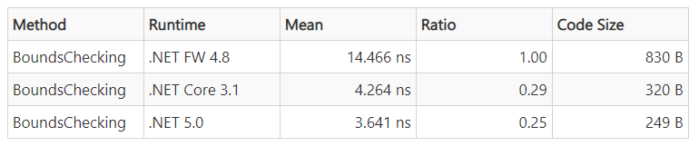

# Links for TVUUG : 4th March 2021

Some helpful steps and links : 

Originally based on the Skrift.io Article : 
[Running Umbraco on a Raspberry Pi or How I stopped worrying and learned to love Linux](https://skrift.io/issues/running-umbraco-on-a-raspberry-pi-or-how-i-stopped-worrying-and-learned-to-love-linux/), this guide has been updated to run on .NET 5 with the [Alpha 3 release of Umbraco](https://umbraco.com/blog/alpha-3-release-of-umbraco-on-net-core/) running on .NET 5. 

## Installing Umbraco (Nightly Build) on a Raspberry Pi

Q: Why? I mean what's the point? What's the point of any of this? Why do we even bother?

A: Performance!

A2: Cost $$$

## Steps to get it running ##

(See references below for more info)

Steps to reproduce : Make appropriate choices to try either the Alpha or nightly

1 - Set your Pi Up + connect to it (See the Skrift Article for details if you're stuck)

2 - Run the .net Core install script

    wget -O - https://raw.githubusercontent.com/CarlSargunar/UmbracoPi/main/Install/installCore.sh | sudo bash

3 - Reboot!

    sudo reboot

4 - Add the Nuget source (Nightly)

For Alpha : 

    dotnet nuget add source "https://www.myget.org/F/umbracoprereleases/api/v3/index.json" -n "Umbraco Prereleases"

For Nightly :    

    dotnet nuget add source "https://www.myget.org/F/umbraconightly/api/v3/index.json" -n "Umbraco Nightly"

5 - Add the Template

For Alpha : 

    dotnet new -i Umbraco.Templates::0.5.0-alpha003

For Nightly :    

    dotnet new -i Umbraco.Templates::0.5.0-*

6 - Create the Project

    dotnet new umbraco -n MyNewSite

7 - Build the Project

    cd MyNewSite
    dotnet build
    
8 - Run the Project

    dotnet run

Once this has kicked off you will be able to access the site from https://localhost:5001

Note : As part of the installation process, the application will need to be restarted - this will happen automatically. You will need to re-run #8 to re-start the kestrel host of the website.

You'll need a sql server somewhere running a database that you can use since Umbraco does not support MySQL (yet).

Other useful links :

 - CMS Docs net Core Specific : https://github.com/umbraco/UmbracoCMSDocs
 - Using Nightly Builds : https://our.umbraco.com/documentation/UmbracoNetCoreUpdates#net-core-nightly-builds
 - Install .net Core on Debian : https://docs.microsoft.com/en-gb/dotnet/core/install/linux-scripted-manual#scripted-install
 - Links for .NET 5.0 SDKs : https://dotnet.microsoft.com/download/dotnet/5.0
 - Performance of .NET Framework vs Core 3.1 vs 5 : https://devblogs.microsoft.com/dotnet/performance-improvements-in-net-5/

